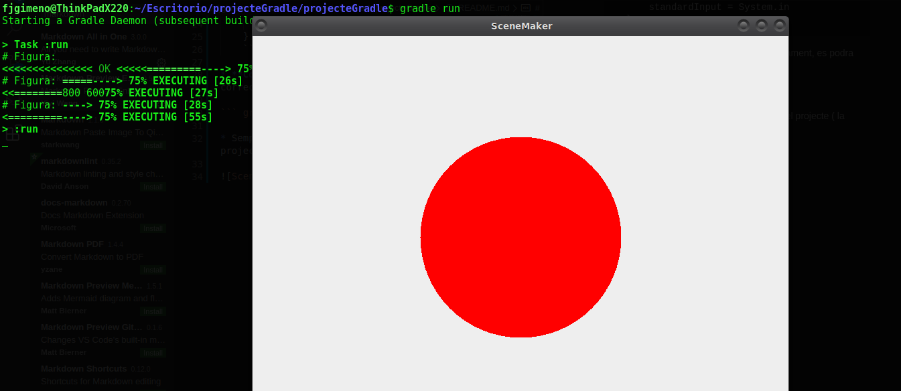

# Scene-maker amb gradle!


## Documentació de la practica:

Per compilar el projecte Scene-Maker utilitzant Gradle, he seguit aquestos pasos.

* **Creacio**: Partint d'una carpeta preferiblement buida, executarem el següent comandament per crear un nou projecte Gradle amb soport java:
  
``` gradle init --type java-application ```
  
* **Arbre**: Amb el projecte ja creat, crearem el arbre de directoris al projecte, per a aixo, entrarem a la carpeta "src" que ens ha creat el comandament anterior, seguit de "main" i "java", en esta ultima he creat el següents directoris:
  
``` .../com/ieseljust/edd/scenemaker ```

* Dins d'aquesta carpeta he colocat totes les clases necesaries per al programa.

* **Configuració**: Una vegada fet lo anterior, he modificat el arxiu "build.gradle" per indicarli a gradle quina es la clase principal del programa, amés de agregar lo següent per fer funcionar la ferramenta "Scanner":
  
  ```   
    run{
        standardInput = System.in
    } 
    ```
  
* **Compilació**: Una vegada configurat correctament, es podra executar el programa amb:

``` gradle run ```

* Sempre que ens trobem a la carpeta arrel del projecte ( la carpeta creada al principi ).

